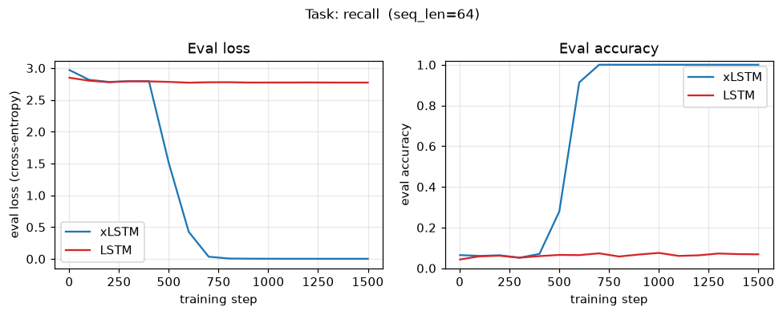
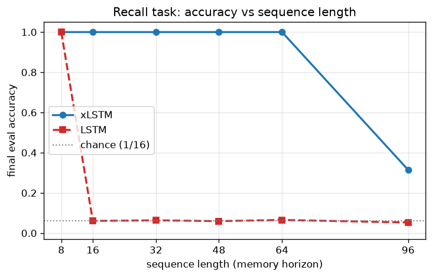

# xLSTM — a from-scratch, educational reimplementation

A clean, tested, **from-scratch PyTorch** reimplementation of the building blocks
of **xLSTM**:

> Beck, Pöppel, Spanring, Auer, Prudnikova, Kopp, Klambauer, Brandstetter,
> Hochreiter. **"xLSTM: Extended Long Short-Term Memory."** NeurIPS 2024.
> [arXiv:2405.04517](https://arxiv.org/abs/2405.04517)

This repo implements the **sLSTM** (scalar memory) and **mLSTM** (matrix memory)
cells with **exponential gating** and the **stabilizer state**, composes them
into pre-norm residual blocks, and trains a small model on a long-range memory
task that it learns in a couple of minutes on CPU.

> ⚠️ **Scope.** This is an independent *educational / portfolio* reimplementation
> for my own understanding — **not** the authors' official code and **not** novel
> research. The goal is a correct, readable, well-tested re-derivation of the
> core mechanics. Deviations from the paper are listed [below](#implementation-notes--deviations-from-the-paper).

---

## Headline result

On a **64-step "remember the first token" recall task** (vocabulary 16, so
chance = 1/16 ≈ 6.25%), the from-scratch xLSTM reaches **100% accuracy** in
~2 minutes on CPU, while a vanilla LSTM trained identically **never beats
chance** — even when given up to **2× more parameters**.



| Model                                   | Params   | Final eval accuracy | Final eval loss |
|-----------------------------------------|---------:|:-------------------:|:---------------:|
| **xLSTM** (2 blocks: mLSTM + sLSTM)     | 124,872  | **100.0%**          | **0.0018**      |
| LSTM (d=64, 2 layers)                   |  68,736  | 6.8%                | 2.7729          |
| LSTM (d=64, 3 layers)                   | 102,016  | 6.2%                | —               |
| LSTM (d=96, 2 layers)                   | 152,256  | 7.0%                | —               |
| LSTM (d=128, 2 layers)                  | 268,544  | 6.5%                | —               |

*Same task, optimizer (AdamW, lr 3e-3, cosine), batch size 64, 1500 steps,
seed 0, CPU. Numbers are real outputs of `scripts/train_demo.py`; reproduce with
the command [below](#run-the-demo). The LSTM failure is the expected
vanishing-gradient behaviour over long horizons — exactly what xLSTM's
exponential gating and improved memory are designed to fix.*

---

## Scaling experiment — where the LSTM collapses

The headline above is a single horizon (64). To find *exactly* where the vanilla
LSTM breaks, `scripts/recall_sweep.py` re-runs the same recall task across a
range of sequence lengths and records the **real** final eval accuracy of a
fresh xLSTM and a fresh LSTM at each one (same optimizer/schedule/seed, deliberately
tiny **1100-step** budget so the whole sweep finishes in **~6.7 min on CPU**).



| Sequence length | xLSTM accuracy | LSTM accuracy |
|----------------:|:--------------:|:-------------:|
|   8             | **100.0%**     | 100.0%        |
|  16             | **100.0%**     | 6.1%          |
|  32             | **100.0%**     | 6.3%          |
|  48             | **100.0%**     | 6.0%          |
|  64             | **100.0%**     | 6.5%          |
|  96             | 31.4%          | 5.3%          |

*Recall task, vocabulary 16 so chance ≈ 6.25%; AdamW lr 3e-3 cosine, batch 64,
1100 steps, seed 0, CPU. Real outputs of `scripts/recall_sweep.py` (raw numbers
in `assets/recall_sweep.json`).*

**What this shows.** The LSTM solves the trivial 8-step recall, then **collapses
to chance the instant the horizon exceeds 8 tokens** — its accuracy sits on the
1/16 chance line from length 16 onward. The xLSTM **holds perfect 100% accuracy
out to 64 tokens**, an 8× longer horizon than where the LSTM breaks.

**Honest caveat at length 96.** Under this deliberately tiny 1100-step budget the
xLSTM only reaches **31%** at 96 tokens — but it is *mid-grok*, not capped out:
its eval accuracy was still climbing steeply right up to the budget cap
(≈0.06 → 0.10 → 0.28 → 0.31 over the final ~500 steps). The recall task is learned
through a late, **sharp "grokking" phase transition whose onset shifts later as
the horizon grows** (it fires by step ~200 at length 16, ~600 at length 64, and
only begins ~step 800 at length 96), so a fixed tiny step budget eventually clips
it. This is a *compute-budget* effect, not a capacity wall — shown honestly
rather than hidden; giving length 96 a larger `--steps` budget lets the xLSTM
grok it too.

```bash
# Regenerate assets/recall_sweep.png + assets/recall_sweep.json (~6.7 min, CPU).
python scripts/recall_sweep.py
# Cheaper/longer variants:
python scripts/recall_sweep.py --seq-lens 8 16 32 64 --steps 800   # ~2 min
python scripts/recall_sweep.py --seq-lens 96 --steps 1600          # let 96 fully grok
```

---

## Architecture

The model is a stack of pre-norm residual blocks over a shared residual stream
of width `d`:

```
tokens ─► Embedding ─►┌──────────────── xLSTM block ───────────────┐─► … ─► LayerNorm ─► Linear head ─► logits
                      │  x ─► LayerNorm ─► (causal conv) ─► CELL ─► │
                      │       GroupNorm ─► gate / projection ─►(+x) │   (mLSTM and sLSTM blocks alternate)
                      └─────────────────────────────────────────────┘
```

* **mLSTM block** ("pre up-projection"): `LayerNorm → up-project → causal conv +
  SiLU → mLSTM (matrix memory) → GroupNorm → output gate → down-project → +residual`.
* **sLSTM block** ("post up-projection"): `LayerNorm → causal conv + SiLU →
  sLSTM (scalar memory) → GroupNorm → gated feed-forward → +residual`.

### The two cells

| | **sLSTM** (`xlstm/slstm.py`) | **mLSTM** (`xlstm/mlstm.py`) |
|---|---|---|
| Memory | scalar cell `c_t` per unit | **matrix** `C_t ∈ ℝ^{d×d}` per head |
| Update | gated add `f·c + i·z` | outer product `f·C + i·(v kᵀ)` (fast weights) |
| Gates | **exp** input (+ stabilizer) | **exp** input (+ stabilizer) |
| Recurrence on `h_{t-1}` | yes, block-diagonal per head | **none** → parallelizable |
| Read-out | `o·c_t / n_t` | `C_t q_t / (n_tᵀ q_t)` (linear attention) |

### Exponential gating + the stabilizer (the crux)

`exp(ĩ_t)` is unbounded and overflows `float32` (`exp(89)=inf`). xLSTM adds a
**stabilizer state** `m_t` (a running max in log-space) and a **normalizer
state** `n_t`. Because the read-out `c_t/n_t` is invariant to a common rescale,
we divide both by `exp(m_t)` to keep everything `O(1)`:

```
log f_t = logσ(f̃_t)                              # (or f̃_t for an exp forget gate)
m_t  = max(log f_t + m_{t-1},  ĩ_t)              # stabilizer — running max
i'_t = exp(ĩ_t        - m_t)   ∈ (0, 1]          # stabilized input gate
f'_t = exp(log f_t + m_{t-1} - m_t) ∈ (0, 1]     # stabilized forget gate

c_t = f'_t · c_{t-1} + i'_t · z_t                # sLSTM scalar memory
n_t = f'_t · n_{t-1} + i'_t
h_t = o_t · c_t / max(|n_t|, exp(-m_t))          # stabilized read-out
```

For the mLSTM, `c_t` becomes the matrix `C_t` updated by `v_t k_tᵀ`, and the
read-out is a query against it. The mLSTM also has an exact **parallel
(linear-attention) form** that is verified to equal the recurrence to `< 1e-6`.
Full derivations are in **[NOTES.md](NOTES.md)**.

---

## Setup

Requires Python ≥ 3.10. CPU-only is fine.

```bash
python3 -m venv .venv
source .venv/bin/activate          # Windows: .venv\Scripts\activate
pip install -r requirements.txt
```

## Run the demo

```bash
# Reproduces the headline figure + table (xLSTM vs LSTM on 64-step recall).
python scripts/train_demo.py --task recall --seq-len 64 --vocab-size 16 --steps 1500
```

This writes `assets/training_curves.png` and `assets/metrics.json`. Other tasks
(`--task parity`, `--task majority`) and sizes are available; see
`python scripts/train_demo.py --help`. The shorter `--seq-len 32` variant is
solved by xLSTM in ~30 s.

## Run the tests / lint

```bash
pytest -q          # 35 fast CPU tests
ruff check .       # lint
```

The tests cover shape correctness for sLSTM/mLSTM/blocks/model, the
matrix-memory update shapes, **numerical stability of exponential gating under
huge inputs** (no NaN/Inf, finite grads), parallel-vs-recurrent mLSTM
equivalence, and an **overfit-one-batch** test proving the blocks drive loss to
~0.

---

## Project structure

```
xLSTM/
├── xlstm/
│   ├── config.py          # dataclass configs (cell / block / model)
│   ├── slstm.py           # sLSTM cell: scalar memory, exp gating, stabilizer
│   ├── mlstm.py           # mLSTM cell: matrix memory, recurrent + parallel forms
│   ├── blocks.py          # CausalConv1d, mLSTM/sLSTM pre-norm residual blocks
│   ├── model.py           # stacked xLSTM model + param counting
│   ├── lstm_baseline.py   # vanilla nn.LSTM baseline (same I/O contract)
│   └── data.py            # synthetic long-range tasks (recall / parity / majority)
├── scripts/
│   ├── train_demo.py      # train xLSTM + LSTM at one horizon, save curves & metrics
│   └── recall_sweep.py    # accuracy-vs-length scaling sweep (xLSTM vs LSTM)
├── tests/                 # pytest suite (shapes, stability, equivalence, overfit)
├── assets/                # committed training_curves.png + recall_sweep.png + *.json
├── NOTES.md               # the gating/stabilizer math, sLSTM vs mLSTM vs LSTM
├── requirements.txt       # pinned deps
├── pyproject.toml         # packaging + ruff + pytest config
└── .github/workflows/ci.yml  # lint (ruff) + tests (pytest) on 3.10–3.12
```

---

## Implementation notes / deviations from the paper

This reimplementation is faithful to the **gating + stabilizer mathematics** but
is deliberately simplified for clarity and CPU-scale demos:

1. **Stabilized read-out floor.** The denominators use `max(|n|, exp(-m))`
   floored by a tiny `1e-6`. The `exp(-m)` term is the paper's "1 in the
   un-stabilized domain"; the extra `1e-6` only prevents a `0/0` when *both*
   `|n|` and `exp(-m)` underflow under extreme inputs (e.g. a huge exponential
   forget gate). It is a no-op in normal regimes.
2. **mLSTM heads** share a single `head_dim` for queries, keys and values, and
   the parallel form is the plain `O(L²)` linear-attention version rather than
   the paper's `O(L)` chunked-parallel kernel. The `O(L)` recurrence is the
   reference; the parallel form is tested to match it numerically.
3. **Causal conv** is a manual depthwise shift-and-accumulate instead of a
   grouped `nn.Conv1d`, because the grouped-conv **backward is pathologically
   slow on CPU** (~10× the rest of the model). The two are mathematically
   identical (and causality is unit-tested).
4. **Blocks** keep the essential pre-norm / projection / conv / GroupNorm / gate
   structure of the paper's blocks but are not a byte-for-byte match of every
   projection ratio and initialization.
5. **Scale.** Everything is sized for a from-scratch CPU demo (≈125k params),
   not the paper's large-scale language-modelling experiments.

None of these change the exponential-gating / stabilizer derivation in
[NOTES.md](NOTES.md).

---

## References

- Beck et al., *xLSTM: Extended Long Short-Term Memory*, NeurIPS 2024 —
  [arXiv:2405.04517](https://arxiv.org/abs/2405.04517)
- Hochreiter & Schmidhuber, *Long Short-Term Memory*, Neural Computation 1997
- Official xLSTM code (for reference, not used here):
  <https://github.com/NX-AI/xlstm>

## License

MIT — this is an educational reimplementation; the xLSTM architecture is due to
Beck et al.
